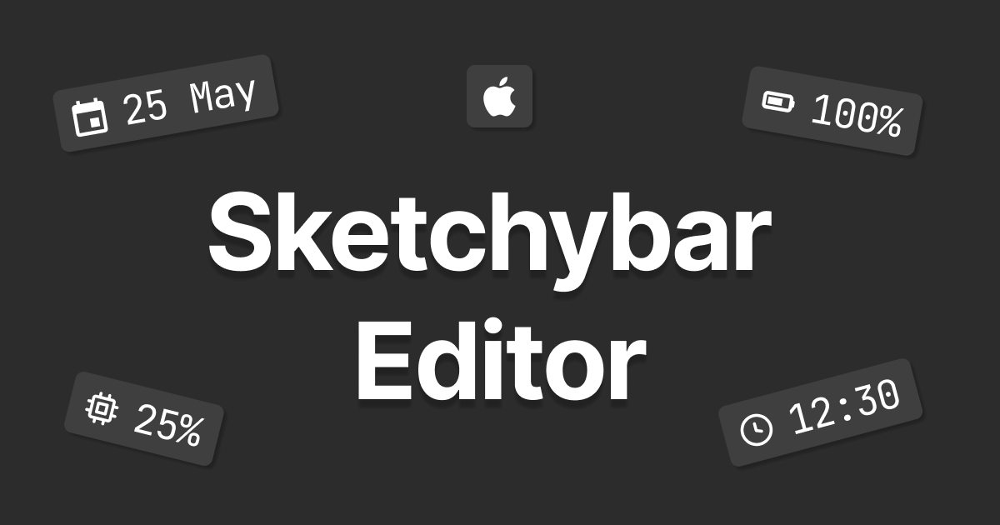

## Description

SketchyBar Editor is a web-based tool that helps you create a solid starting configuration for SketchyBar. It gives you a clean,
well-structured file you can download, study, and build on, making it easier to understand how things work before diving into code.

## How to Use

1. Open the editor and start adding items to your status bar
2. Customize the layout and behavior using the visual interface
3. Click the **"View Config"** button to export your configuration as a `sketchybar.zip` file
4. Extract the contents into your SketchyBar config directory (`~/.config/sketchybar/`).  
   Make sure the files go **directly** into the `sketchybar` folder—not into a nested `sketchybar/sketchybar` path.

   Terminal example:

   ```bash
   mkdir -p ~/.config/sketchybar
   unzip sketchybar.zip -d ~/.config/sketchybar
   ```

## Contributing

Contributions to improve SketchyBar Editor are welcome! Here's how you can contribute:

### Adding New Items

The most common contribution is adding new item types:

1. Create a new item definition file in `/src/items/` directory
2. Follow the existing item structure (see examples like `apple.tsx` or `battery.tsx`)
3. Register your item in `src/lib/items-imports.tsx` by adding a named export

Example of a basic item structure:

```ts
function AppleItem({ itemSettings }: SketchybarItemComponentProps) {
  return <BaseItem itemSettings={itemSettings} icon={"󰀵"} />;
}

export const appleItemDefinition: ItemDefinition = {
  type: 'apple',
  displayName: 'Apple Logo',
  description: 'Shows the Apple logo',
  tags: ['logo', 'system'],
  component: AppleItem,
  requiresPlugin: false,
  defaultIcon: "󰀵",
  generateItemConfig: (itemName) => `sketchybar --set ${itemName} icon=󰀵\n`
}
```

### Other Contributions

We also welcome contributions in these areas:

- UI/UX improvements
- Performance optimizations
- Bug fixes
- New features and functionality
- Documentation improvements

To contribute, fork the repository, make your changes, and submit a pull request with a clear description of your modifications.

## License

[MIT License](LICENSE)

## Acknowledgments

Built for use with [SketchyBar](https://github.com/FelixKratz/SketchyBar), a powerful and customizable status bar for macOS.
